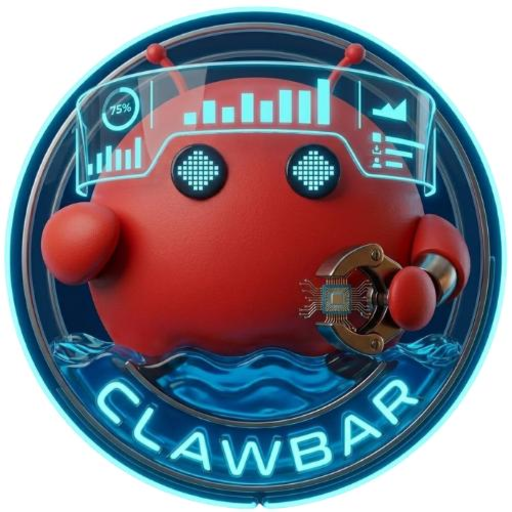

# Clawbar

<p align="center">
  
</p>

<p align="center">
  A native macOS menu bar app and CLI for tracking AI token usage, quota resets, costs, and provider status across TheClawBay, Claude, Codex, Gemini, Cursor, and 20+ more services.
</p>

<p align="center">
  <a href="https://github.com/blacki2016/Clawbar/actions/workflows/ci.yml"></a>
  <a href="https://github.com/blacki2016/Clawbar/releases"></a>
  <a href="LICENSE"></a>
</p>

## What Clawbar does

Clawbar keeps your AI usage visible without leaving the menu bar. It reads provider-specific quotas and status data, shows reset timers, exposes the same data in a fast CLI, and can surface a compact WidgetKit view in Notification Center.

Use it when you want one place to check:

- session and weekly quota remaining
- reset timers and trend direction
- local token costs and usage history
- provider status without opening vendor dashboards
- multiple AI accounts from one macOS app

## Highlights

- Native macOS app with no Dock icon and a fast SwiftUI/AppKit menu bar experience
- CLI commands for usage, costs, models, config validation, and JSON output
- 20+ providers including TheClawBay, Claude, Codex, Gemini, Cursor, OpenRouter, Copilot, Kilo, Kimi, Perplexity, Vertex AI, and more
- Notification Center widget support for usage and compact metrics
- Keychain-backed credentials plus app-group data sharing for widgets
- Local cost analysis from logs, not just remote quota polling

## Screenshots

| Menu bar overview | App icon |
| --- | --- |
|  |  |

## Install

### Homebrew

```bash
brew install blacki2016/tap/clawbar
```

Installs `Clawbar.app` to `/Applications` and links the `clawbar` helper into your Homebrew binary path.

### Shell installer

```bash
curl -fsSL https://raw.githubusercontent.com/blacki2016/Clawbar/main/install.sh | bash
```

Downloads the latest macOS release, installs the app to `/Applications`, and creates a CLI symlink.

### CLI-only installer

```bash
curl -fsSL https://raw.githubusercontent.com/blacki2016/Clawbar/main/install-cli.sh | bash
```

Installs only the CLI bundle into `~/.local/share/clawbar` and links `clawbar` in `~/.local/bin`.

### Direct download

- Download the latest archive from [GitHub Releases](https://github.com/blacki2016/Clawbar/releases)
- Extract `Clawbar.app`
- Move it to `/Applications`
- Optionally link the CLI:

```bash
ln -sf "/Applications/Clawbar.app/Contents/Helpers/clawbar" /opt/homebrew/bin/clawbar
```

## Quick start

```bash
# Show all configured providers
clawbar usage

# Focus on TheClawBay
clawbar usage --provider theclawbay --source api

# List available models for TheClawBay
clawbar models --provider theclawbay

# Inspect local token costs
clawbar cost

# Validate your config
clawbar config validate
```

## Providers

Clawbar currently supports:

- TheClawBay
- Claude
- Codex
- Gemini
- Cursor
- OpenRouter
- Copilot
- Kilo
- Kimi and Kimi K2
- Kiro
- Vertex AI
- Antigravity
- Factory / Droid
- z.ai
- Perplexity
- Minimax
- Augment
- Amp
- JetBrains AI
- Alibaba Cloud
- Ollama
- Warp
- Synthetic

Provider-specific setup docs live in [docs/providers.md](docs/providers.md) and the individual files inside [docs](docs).

## Configuration

Clawbar looks for configuration in `~/.clawbar/config.json` with a legacy fallback to `~/.codexbar/config.json`.

```json
{
  "providers": {
    "theclawbay": {
      "apiKey": "your-api-key"
    },
    "claude": {
      "source": "oauth"
    }
  }
}
```

See [docs/configuration.md](docs/configuration.md) for the full schema and provider-specific options.

## CLI reference

```text
clawbar usage [--provider ...]
clawbar cost [--provider ...]
clawbar models [--provider theclawbay]
clawbar config validate
clawbar config dump
```

Global flags include `--format json`, `--pretty`, `--no-color`, and `--verbose`.

## Local development

```bash
git clone https://github.com/blacki2016/Clawbar.git
cd Clawbar
./Scripts/compile_and_run.sh
```

The project uses Swift Package Manager. Release packaging, signing, and distribution scripts live in [`Scripts`](Scripts).

## License

MIT. See [LICENSE](LICENSE).
